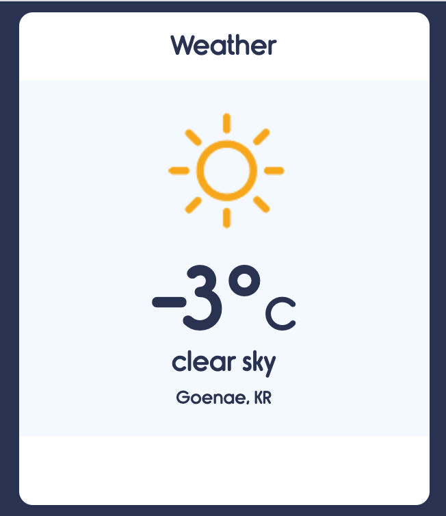

# Weather App

**[Description] When you allow the web browser to use your current location, it shows the weather of where you are.**

* Weather API: https://openweathermap.org/ 
* Icons Reference: https://github.com/manifestinteractive/weather-underground-icons

## Demo Website

👉🏼 [Weather App](https://cocky-goldstine-168cea.netlify.app/)

